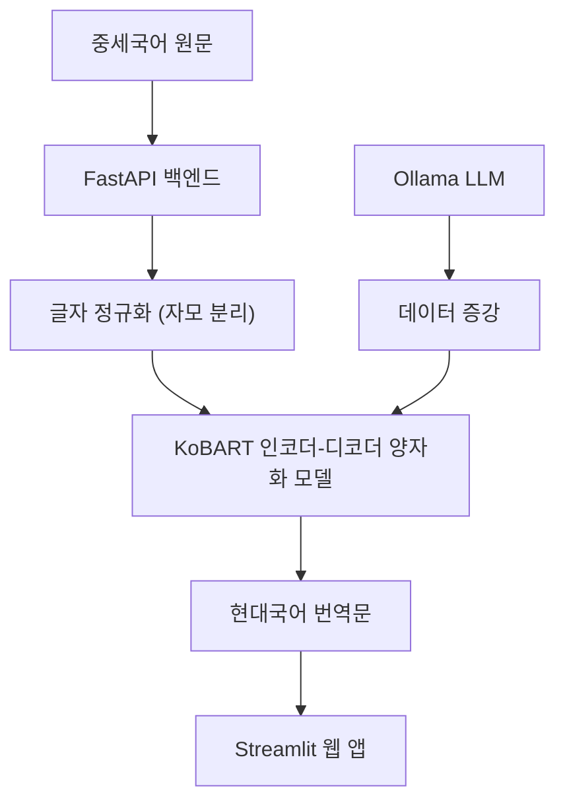
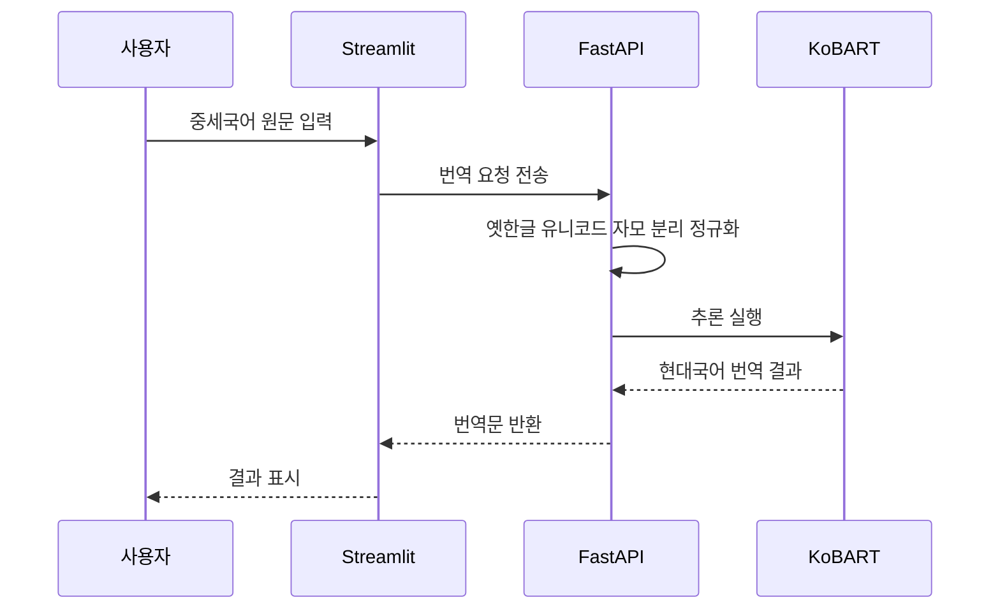

# 중세국어 AI (NMT-MK)


중세국어 신경망 기계 번역 체계 개발 기획

## 기술 구조 및 작업 흐름

### 구조도

### 순서도


## 성능 및 평가 결과
본 기획은 다양한 환경(GPU, CPU, ONNX 양자화)에서의 성능 측정 지표를 제공합니다. 아래는 기준 모델(KoBART)을 대상으로 한 하드웨어 및 최적화 설정별 성능 측정 결과입니다. (측정 표의 샘플 수는 100개 기준입니다.)

| 평가 환경 | 평균 지연 시간 | 처리량 | 리소스 및 모델 크기 | 번역 품질 점수 (BLEU) | 번역 품질 점수 (chrF) | 환각 비율 |
| :--- | :--- | :--- | :--- | :--- | :--- | :--- |
| GPU (RTX 5080) | 352.87 ms | 2.83 seq/s | 504.71 MB VRAM 할당 | 9.62 | 11.36 | 0.58 % |
| CPU | 1353.65 ms | 0.74 seq/s | 496.00 MB 모델 크기 | 9.62 | 11.36 | 0.58 % |
| CPU ONNX 양자화 모델 | 500.50 ms | 2.00 seq/s | 258.37 MB 모델 크기 | 9.62 | 11.36 | 0.58 % |

측정 일시: 2026-05-28 (두 번째 모델 기준 CPU 성능 측정 추가 반영)
참고: 현재 데이터 처리 과정을 통해 정제된 중세국어-현대어 병렬 데이터셋 1,600여 쌍 이상이 확보되었으며 세 번째 모델 학습 대기 중입니다. 추후 세 번째 학습 완료 시 지표를 새롭게 갱신할 예정입니다.

### 완료된 성능 측정 및 경량화 성과
- CPU 환경 추론 성능 확보: 실제 웹 서비스 배포 환경을 고려하여 CPU 환경에서의 성능 측정을 수행하였습니다.
- ONNX 동적 양자화 적용: 모델 파일 크기를 약 48% 절감하였으며, 기존 대비 약 2.7배의 처리량 향상 및 평균 지연 시간을 500.50 ms 수준으로 단축하여 경량 배포 환경 요구 사항을 만족하였습니다.

## 기획 개요
본 기획은 15세기에서 17세기 사이의 중세국어(옛한글) 문헌을 현대어로 정교하게 번역하는 AI 모델을 구축하는 것을 목표로 합니다. 데이터가 부족한 중세국어의 특성을 극복하기 위해 LLM(거대 언어 모델)을 통한 데이터 증강과 역사 문헌 데이터베이스 크롤링 파이프라인을 구축합니다.

### 기획 참여자

<table>
  <tr>
    <td align="center"><br /><sub><b>안현찬</b></sub><br />수석 개발<br /></td>
    <td align="center"><br /><sub><b>유보라</b></sub><br />중세국어 번역 데이터 검수<br /></td>
  </tr>
</table>

## 데이터 출처
본 기획은 다음의 신뢰도 높은 역사 문헌 데이터베이스를 주요 출처로 활용합니다.
- 한국고전종합DB: 세종한글고전 (소학언해, 삼강행실도, 석보상절 등 순수 15세기 중세국어 원문)
- SCP-KO 15C 중세 국어 자료실: 중세국어 어형, 소릿값 및 어휘 사전 구축을 위한 참고 데이터 (루트 경로 `data/raw/`에 보관)
- 주의: 한문 원문 기반의 조선왕조실록 및 근대 행정 문서는 환각 방지를 위해 배제됨.

## 기술 개발 방향 및 사양
하드웨어 인프라
- CPU: AMD Ryzen 9 9900X
- GPU: NVIDIA RTX 5080 (16GB VRAM)
- RAM: 64GB DDR5

모델 구조
- 오프라인 데이터 증강 모델: Ollama 기반 로컬 LLM
- 실시간 번역 전용 모델: KoBART (Encoder-Decoder) 전이학습 (추론 경량화)
- 텍스트 표준화: NFD(자모 분리) 기반 옛한글 유니코드 정규화 및 토크나이저 어휘 사전 동적 확장

## 시작하기
외부 개발자 및 협업자가 로컬에서 프로젝트를 구동하기 위한 가이드입니다.

### 1. 환경 설정 및 의존성 설치
본 프로젝트는 Python 3.14 이상 환경을 권장합니다.
```bash
pip install -r requirements.txt
```

### 2. 번역 API 서버 구동
RESTful 형태의 중세국어 번역 서버(FastAPI)를 시작합니다.
```bash
uvicorn src.api.app:app --reload
```

## 디렉토리 구조
- `.github/workflows/`: GitHub Actions 기반 CI/CD 파이프라인 구성 파일
- `data/`
  - `raw/`: 원시 데이터 및 보관소
  - `processed/`: 옛한글 정규화 및 필터링 완료 코퍼스
  - `synthetic/`: LLM 기반 합성 데이터 저장소
- `models/`: 다운로드된 베이스 모델 및 파인튜닝 모델 체크포인트
- `scripts/`: 검사 및 변환용 단일 실행 스크립트들
- `docs/`: 계획서 및 이미지 에셋 모음
- `src/`
  - `api/`: FastAPI 서버 및 Streamlit 앱
  - `augment/`: LLM 기반 합성 데이터 생성 및 필터링
  - `crawlers/`: 역사 DB 크롤러
  - `models/`: 모델 로딩, Inference, OCR, 평가 스크립트
  - `preprocess/`: 데이터 정제 및 옛한글 자모 분리 유니코드 정규화
  - `tests/`: 벤치마크 및 단위 테스트
  - `train/`: 모델 파인튜닝 스크립트

## 현재 진행 상황
- 제8~10단계 (데이터 재구축 및 모델 학습 파이프라인 완성): 
  - [해결됨] 근대 한문 노이즈가 섞인 기존 864쌍 데이터를 한자 비율 및 특정 키워드로 필터링하여 454쌍의 순수 데이터 구출 (이슈 #1).
  - [해결됨] 1,200여 개의 15세기 원문을 활용하는 LLM 역번역 데이터 증강 체계 구축 (이슈 #1).
  - [해결됨] KoBART 토크나이저의 자모 분리 옛한글 처리 문제를 해결하기 위해 동적 어휘 사전 확장 및 모델 차원 조정 로직 구현 완료 (제9단계).
  - [해결됨] 생성된 역번역 데이터의 환각 현상을 차단하기 위한 1차 자동 길이 및 단어 필터링 로직 구현 (제10단계).
  - [해결됨] 검수자를 위한 실시간 마우스 클릭 검수용 Streamlit 웹 앱 개발 완료 (제10단계).

## 배포 및 서비스 계획
- 자체 학습한 경량 번역 모델을 활용하여 Hugging Face Spaces 기반 오픈소스 AI 웹 서비스로 배포 예정.
- 국어사 연구자 및 학생들을 위한 비영리 학술 보조 도구로 무료 개방.

## 라이선스 및 이용약관
본 프로젝트는 오픈소스 생태계와 외부 공공 데이터를 적극 활용하고 있으며, 다음의 이용약관 및 라이선스를 철저히 준수합니다.
1. 외부 AI 모델 라이선스:
   - KoBART 베이스 모델: 오픈소스 라이선스에 따라 비영리 및 연구 목적으로 활용 중입니다.
   - OCR 엔진: 오픈소스 모델로 관련 라이선스를 준수합니다.
2. 외부 데이터셋 주의사항:
   - 위키 기반 데이터는 CC-BY-SA 3.0 라이선스를 따릅니다.
   - 외부 기관의 인가된 말뭉치를 추가로 확보할 경우 원문 복제 및 외부 배포 금지 조항을 엄격히 준수하며, 프로젝트는 번역 및 인식 모델의 가중치만 배포합니다.

## 참고문헌
본 프로젝트의 학습 및 검증에 활용되거나 추가 수집 대상으로 지정된 고문헌 자료들입니다. (출처: 한국고전종합DB - 세종한글고전)

### 석보상절 (1447년)
세종의 명으로 수양대군(세조)이 부처의 일대기와 설법을 엮어 편찬한 최초의 산문 자료.
- [역주 석보상절 제6](http://db.sejongkorea.org/front/detail.do?bkCode=P13_SS_v006&recordId=P13_SS_e01_v006)
- [역주 석보상절 제9](http://db.sejongkorea.org/front/detail.do?bkCode=P13_SS_v009&recordId=P13_SS_e01_v009)
- [역주 석보상절 제11](http://db.sejongkorea.org/front/detail.do?bkCode=P13_SS_v011&recordId=P13_SS_e01_v011)
- [역주 석보상절 제13](http://db.sejongkorea.org/front/detail.do?bkCode=P13_SS_v013&recordId=P13_SS_e01_v013)
- [역주 석보상절 제19](http://db.sejongkorea.org/front/detail.do?bkCode=P13_SS_v019&recordId=P13_SS_e01_v019)
- [역주 석보상절 제20](http://db.sejongkorea.org/front/detail.do?bkCode=P13_SS_v020&recordId=P13_SS_e01_v020)
- [역주 석보상절 제21](http://db.sejongkorea.org/front/detail.do?bkCode=P13_SS_v021&recordId=P13_SS_e01_v021)

### 삼강행실도 (1432년 / 언해본 1481년)
조선 초기 백성들의 윤리 교화를 위해 편찬된 서적으로, 삽화와 함께 중세국어 원문이 기록되어 있습니다.
- [역주 삼강행실효자도](http://db.sejongkorea.org/front/detail.do?bkCode=P01_SG_v001&recordId=P01_SG_e01_v001_0000)
- [역주 삼강행실충신도](http://db.sejongkorea.org/front/detail.do?bkCode=P01_SG_v001&recordId=P01_SG_e01_v002_0000)
- [역주 삼강행실열녀도](http://db.sejongkorea.org/front/detail.do?bkCode=P01_SG_v001&recordId=P01_SG_e01_v003_0000)

### 기타 교화 문헌
- 이륜행실도 (1518년): [역주 이륜행실도](http://db.sejongkorea.org/front/detail.do?bkCode=P02_IR_v001&recordId=P02_IR_e01)
- 정속언해 (1518년): [역주 정속언해](http://db.sejongkorea.org/front/detail.do?bkCode=P03_JS_v001&recordId=P03_JS_e01)
